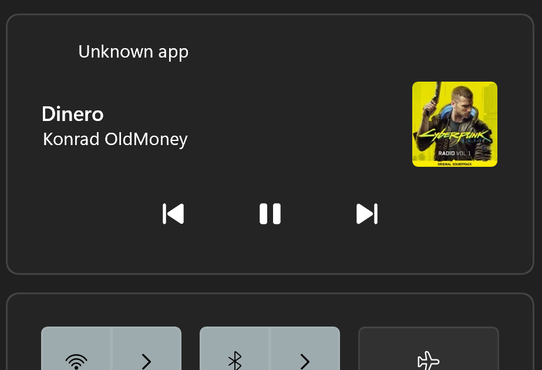
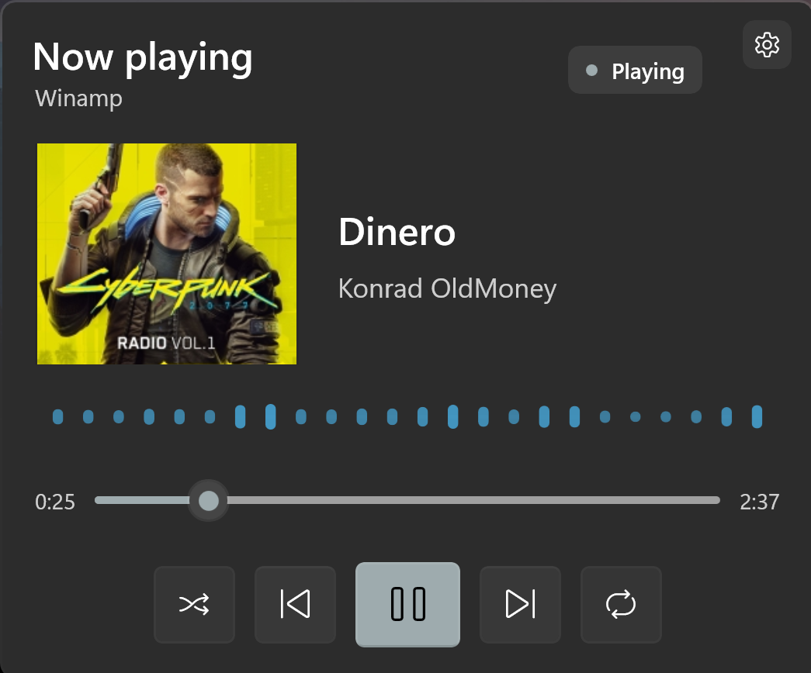

# Winamp SMTC Plugin
General Winamp Plugin to enable support for Windows System Media Transport Controls.

### Windows Notification when playing Winamp

### Widbar with Media gadget when playing Winamp

## Notes
Winamp 2.x General Purpose plugin starter, **Win32/x86**, MSVC **v145**, C++17.

Visual Studio 2026 uses the v145 platform toolset for MSBuild C++ projects.

Open `WinampSMTC.sln`, select **Release | Win32**, then Build Solution.

Output:
`bin\Release\gen_winsmtc.dll`

Copy that DLL into the Winamp 2.95 `Plugins` directory. Restart Winamp.
The plugin should be available under the "General Purpose" plugin list.

## Known issues
Windows Media Notification Center shows "Unknown app" instead of "Winamp".

## License
Licensed under the [MIT License](LICENSE).

## Author
Oliwier Ptak, 2026